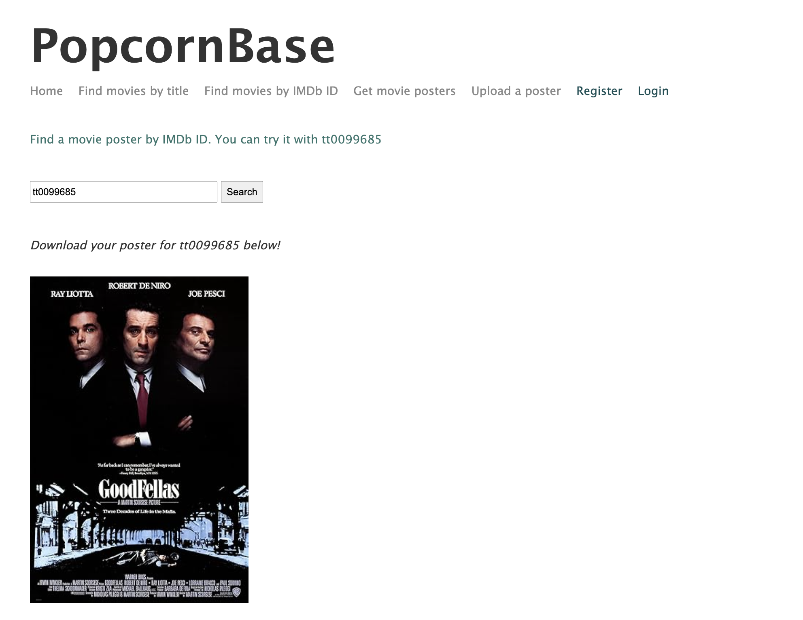

# PopcornBase

  

This is a static, Node-based RESTful API created as part of my university course at the Queensland University of Technology. The application no longer works (except for fetching posters) as the API has been taken down by the university.

A better version of this app is currently under development.

## Tech

- **Node.js & Express** for user requests.
- **MySQL** database for user and movie information.
- **Knex.js** library for database queries.
- **Handlebars** for server-side templating.
- **JWT** for sessions.
- **Winston** for logging.
- **Helmet & express-rate-limit** for security.

**_Please feel free to read the full report for this project found in the report directory._**
